Every font is the outcome of many decisions, large and small. This document explains key decisions in the making of the Skeena Indigenous font family, from the inception of the design to its release under the [Open Font License v1.1](https://openfontlicense.org/open-font-license-official-text/) as a focal point for engagement with indigenous language communities. The document discusses both design and implementation decisions and, importantly, explains how things might be done differently: what other decisions could have been made, and why those decisions might be more suitable to other projects.

### Origins
Skeena Indigenous is an indigenous-first project, in which priority is given to supporting orthographic and typographic norms of indigenous languages of North America, rather than prioritizing those of European settler languages. However, the core design of the typeface originated in prior projects conducted by Tiro Typeworks for Microsoft between 2018 and 2021. The design that became Skeena was initially developed by Paul Hanslow and John Hudson as a proposal for a new user interface typeface, and a couple of years later it was refined and extended as one of five candidates to replace Calibri as the default text fonts in Microsoft Office. Skeena wasn’t selected for that role, but it remained a design with which Paul and I were very pleased, and which I always thought would be useful. The core concept of a sans serif type with modulation between thick and thin stroke weights lends itself well to both continuous text for reading as well as dramatic display typography, especially in its heavier weights. This is a surprisingly under-represented style, which also means it looks fresh compared to the many sans serif font families in well-trodden genres such as grotesk and geometric sans.

The dual suitability for running text and display settings recommended the Skeena design as a starting place for extending the typographic palette of indigenous languages, many of which have been limited to a small number of typefaces in a narrow range of weights and styles, and sometimes to a single font. The choice of sans serif over more traditional serif type style also enabled Paul and I to directly apply some of the things we had learned when designing letterforms for the hən̓q̓əmin̓əm̓ (Musqueam) and nsyilxcən (Syilx) languages for signage at the University of British Columbia ([Whitney Salishan](https://news.ubc.ca/2023/05/new-ubc-font-whitney-salishan-language/)).

The idea for a new, indigenous-first version of Skeena emerged early in the discussions of an ad hoc group convened by Microsoft’s Advanced Reading Technologies team in late 2022. This group was initially focused on Coast Salish language support, including not only fonts but keyboard layouts, localization and other aspects of language processing, and community engagement to identify the needs and preferences of language keepers and those involved in linguistic preservation and revitalization. As the group grew to include more people from outside Microsoft, the scope of the project was also extended, firstly to non-Salishan languages of the Pacific Northwest (broadly, British Columbia, Washington, and Oregon), and then to languages from other parts of North America. Different aspects of the larger project engage with different more or less extended parts of this broader scope. Work in community engagement, localized data and keyboards, is currently still largely focused on Salishan languages, in effect working outwards from Microsoft’s headquarters in the Seattle area. The font, on the other hand, is running out ahead of these efforts, and there is a good reason for that.

Skeena Indigenous is intended to provide a focal point for engagement. It is a template for a particular way to approach indigenous language support in fonts, which will hopefully inspire and assist other font makers to support these languages. It is also a conversation starter for engagement with indigenous communities and language revitalization organizations. Skeena Indigenous is a material thing we can point to and ask questions such as 

* *Does this support all the characters you need for your alphabet?* 
* *Did we get the shape of these characters right?* 
* *Are the defaults suitable for your language, or do you have local preferences for the shape of certain characters?* 
* *How can we improve these fonts?* 
* *What other styles of typography would you like to see in your language?*

Skeena Indigenous is a unified font project; that is, it seeks to support a large number of languages withing a single character and glyph set, rather than targeting individual languages with separate, tailored fonts. This requires that some glyphs—the individual forms of characters—need to be made default and, where local, language-specific variants exist, these are handled via glyph processing substitutions. A unified font project is beneficial for companies seeking to support a wide range of languages: this is why, for example, pan-European language fonts are a common baseline for much font development. This is not, of course, the only way to make fonts, and there are several good reasons why a language community might want to have a more precisely tailored font, one that supports only their character set needs and that ensures default forms reflect local preferences and conventions. As an Open Font License release, the Skeena Indigenous project may be freely forked to produce such tailored subsets.

### Alphabets

Many indigenous language orthographies of North America are strongly phonetic, and employ a combination of common Latin letters, specialized letters and other signs—many derived from the Americanist Phonetic Alphabet (APA)—, combining diacritic marks, and features not found in European orthographies *e.g.* superscript modifier letters. In addition, many of the orthographies use combinations of letters—digraphs or trigraphs—to represent individual sounds, and these are typically reckoned as individual alphabetic units, with implications for tailored sorting and casing.

There is considerable diversity of phonetic representation across North American orthographies. Some languages favor diacritic marks over digraphs to represent consonant sounds, or vice versa; some use doubled-vowels to indicate long vowel sounds and others employ diacritic marks or the phoneticist vowel length sign (or a close approximation—see notes on encoding).

Most of the alphabets sort with interleaved vowels and consonants, often approximating English alphabet order with insertion of diacritic letters or digraphs, *e.g.* Saik’uz Dakelh:

a b ch ch’ d dl dz d̲z̲ e g gh gw h i j k k’ kh kw kw’ l lh m n ng o oo s s̲ sh t t’ tl tl’ ts ts’ t̲s̲ t̲s̲’ u w wh y z̲ z ’

A few alphabets sort with the vowels grouped at the beginning, followed by the consonants, and other vice versa.

Alphabet length varies considerably, even between some closely related languages. This reflects either different phonemic inventories or, in the case of related languages, different categorization of alphabetic units. So, for example, the alphabet of the Dakelh language Yekooche reckons the glottalization sign ’ as a separate unit:

a b ch ch’ d dl dz d̲z̲ e g gh gw h i j k k’ kh kw kw’ l lh m n ng o oo s s̲ sh t t’ tl tl’ ts ts’ t̲s̲ u u̲ w wh y z z̲ ’

while the alphabet of the related Southern Carrier language conventionally lists all glottalized vowels as individual units:

a ’a a’ ’a’ b ch ch’ d dl dz d̲z̲ e ’e e’ ’e’ g gh gw h i ’i i’ ’i’ j k k’ kh kw kw’ l lh m n o ’o o’ ’o’ oo ’oo oo’ ’oo’ s s̲ sh t t’ tl tl’ ts ts’ t̲s̲ u ’u u’ ’u’ ai ’ai ai’ ’ai’ w wh y z

The shortest alphabet targeted by Skeena Indigenous is that of the Ktunaxa First Nation of the BC interior (observe use of the cent sign as a letter in this alphabet; see notes on encoding):

a a· ¢ ¢̕ h i i· k k̓ l ǂ m m̓ n n̓ p p̓ q q̓ s t t̕ u u· w x y ʔ ·

The longest is that of the Southern Tutchone First Nation of the Yukon, which includes vowel tone, length and nasalization diacritics:

ch chʼ d ddh dh dl dz g gh ghw gw h j k kh khw kw kʼ kʼw l ł m mb n nd nj r s sh t tʼ th tl tth tthʼ ts tsʼ tlʼ y w z zh ʼ a ä à ā á ą ą̈ ą̀ ą̄ ą́ ą̈w ąw ąy äy ą̈y e è i o u ü ų̈ ē ī ō ū é í ó ú ę į ǫ ų â ê î ô û ǎ ě ǐ ǒ ǔ ā́ ḗ ī́ ṓ ū́

The boundaries of an ‘alphabet’ may be fuzzy. Some language communities may mark stress accents regularly and consider vowels with acute or grave accents as part of the alphabet, while others may use such diacritics irregularly, and may not list them in the inventory of letters.

Documenting the alphabets of target languages is a first step to defining the character set and glyph repertoire for a font. It is also not always a simple task. Conflicting documentation may be found for a language, leading to doubt as to which is accurate. Some orthographies have undergone multiple iterations and may still be subject to change by the language community. Even when an alphabet seems stable, examination of texts in the language may uncover inconsistencies.

In creating a unified font project like Skeena Indigenous, it is best to err on the side of inclusion: if a letter occurs in the documentation of an alphabet or in language texts, it should be supported in the character set. Font makers working directly with individual language communities, of course, have the benefit of being able to document the needs of those communities and to provide a more precisely targeted character set.

The superset of characters identified for support in Skeena Indigenous was developed over a period of several months. It began by collecting together information on Coast Salishan alphabets but rapidly expanded to cover other language groups of the Pacific Northwest. Much of the initial information was gleaned from the [FirstVoices](https://www.firstvoices.com/) project of the BC [First Peoples’ Cultural Council](https://fpcc.ca/), with additional information on Washington State languages derived from [previous work](https://github.com/aaronbell/Salishan) by Aaron Bell at Saja Typeworks, from information provided by individual language contacts, and from the websites of language communities. After much of the design work to support these languages in Skeena Indigenous was already advanced, we found time to expand the character set to cover a broader set of languages from across the continent, using as a source the alphabets documented in the Typotheque publication *[Indigenous North American Type](https://www.typotheque.com/books/indigenous-north-american-type)*.

### Encoding

The Skeena Indigenous fonts presume Unicode Standard text encoding. That’s a fairly safe assumption for most text these days, but some language communities may still be using older fonts that were hacks of 8-bit ASCII encoding or have significant legacy text in non-standard encodings. Some communities may be using both Unicode and non-Unicode fonts, and struggling with text interchange.

Even where text reliably uses Unicode characters, there may be inconsistencies in the encoding of texts in a given language. These result from a number of factors: some Unicode characters have similar appearance (confusables) and users may not reliably employ the same codepoint to encode an intended character; a community may have an unstable orthography in which the choice of how to encode a particular character has changed or will change; a user seeing a character in use may unwittingly select a look-a-like that is more conveniently input from his or her keyboard, leading to divergent encodings that may then be further disseminated by copying and pasting; the Unicode Standard may introduce new characters that provide preferred encodings for some entities—*e.g.* Latin script versions of letters derived from Greek, with different casing forms—and adoption of these may introduce inconsistencies with encoding of older texts. Even when a community has adopted a standard encoding that it seeks to use in language education and communication, inconsistencies can creep in over time as members seek to use their language in emails, text messaging, social media, etc..

Font makers need to be aware of these encoding issues and make decisions about how to address them. One approach is to try to accommodate divergent encodings, which is most easily done when developing a font for an individual language community. In that case, multiple codepoints might map to identical glyphs, or to the same glyph, such that it doesn’t matter how the text is encoded: the font will display it the same way, according to the preferences of form and positioning in that community. The problem with this approach, of course, is that it masks encoding inconsistencies, leading to ongoing issues with text interchange, undermining reliable searching and sorting in educational resources such as dictionaries, and resulting in messy typography when text is displayed in a different font that does not follow the same character-to-glyph mapping decisions.

#### Precomposed vs decomposed

When the Unicode project began in the 1980s, several principles were established to guide decisions about what to characters to encode, and some of these principles are contradictory and result in apparent inequalities that introduce complications for some indigenous languages.

One principle was that diacritics consisting of a letter with an accent, tone or other mark—typically above or below—should not be encoded as precomposed, atomic characters but, instead, should be encoded as sequences of a base letter character followed by one or more combining mark characters. However, another and contradictory principle was that Unicode should provide a one-to-one code mapping with pre-existing standard 8-bit character sets defined by national standards or in widespread use. Many precomposed diacritic characters used in European languages were inherited into Unicode under this principle.

The existence of precomposed diacritics in the standard means that some characters in text could be encoded in more than one way—as the precomposed character or as the sequence of base plus combining mark characters—and software needs to know that these are equally valid and should be treated as identical for functions like text searches or sorting what Unicode calls canonical equivalence.

Since these inherited precomposed diacritic characters are *exceptions* to the principle that diacritics should be encoded as sequences of base letters with combining marks. Their existence also requires additional work by software to keep track of canonical equivalence, so other standards organizations—notably the Internet Engineering Task Force—asked Unicode to commit to not adding any more characters that have canonical decompositions; that is, to commit to enforcing the first principle regarding how diacritics should be encoded using combining marks.

The apparent inequality this introduces is that diacritics for European and some other languages are encoded in Unicode as precomposed, atomic characters, but the diacritics needed to write many of the world’s languages—including many in the Latin script orthographies of indigenous languages of the Americas—are not. Hence, indigenous peoples may ask, not unreasonably, *‘Where is this important character in our alphabet? Why isn’t it included in Unicode?’*—and the answer is that it *is* included, just not as a precomposed, atomic character with a single code. This may look like a double-standard—one rule for European writing systems, and another for indigenous ones—, but the goal of implementation in software, in fonts, in keyboards and other input methods should be to make the distinction between precomposed and decomposed diacritics invisible and the experience of indigenous users creating and reading texts in their languages seamless and intuitive.

This means, among other things, that those of us making fonts for indigenous languages do need to be aware of the distinction, and to make decisions about how to handle decomposed code sequences at the point where the abstract characters become visible glyphs. In Skeena Indigenous, all supported diacritics with atomic encodings in Unicode are provided as precomposed glyphs, while most decomposed encodings are not but are instead displayed using [GPOS](https://learn.microsoft.com/en-us/typography/opentype/spec/gpos) mark anchor attachments or other positioning mechanisms. Only a few base+mark sequences are displayed using dedicated glyphs (mapped from the sequence in the [GSUB](https://learn.microsoft.com/en-us/typography/opentype/spec/gsub) `ccmp` feature). These exceptions involve graphical merging of the base and mark, idiosyncratic positioning of a particular mark on that base, or possible preferred variants of a precomposed character glyph.

#### Confusables

The problem of confusable or look-a-like characters is often exacerbated by glyph representation at the font level. It is not unusual for an indigenous language community to have only a single font, sometimes derived from an older, non-Unicode font made by volunteers or by linguists working with the community. In converting such a font to use Unicode, choices are made about which codepoint to use based on the appearance of a character in that font, and this can involve guessing which of two or more similar Unicode characters should be used. The Unicode Standard does not always provide clear guidance for either font makers or language communities facing such choices, and some indigenous alphabets end up including questionable encoding decisions. This can lead to confusion when new fonts are made in which the glyph representation of a letter or the positioning of a diacritic mark is tailored to the preferences of a particular community rather than representing typical norms for that character according to the Unicode Standard.

As explained above, Skeena Indigenous aims to provide broad coverage for many different orthographies, and to support as many languages as possible with its default character representation. This means treating the design of individual characters in accordance with the intent of the Unicode Standard, as far as that can be ascertained. This means that the representation of some characters in Skeena Indigenous may differ from what a particular language community is used to in its previous font or fonts. There is room within the Skeena Indigenous project to provide preferred, variant glyph forms of characters for individual languages or groups of languages. Indeed, part of the purpose of the project is to elicit information about such preferences, and such variants are already provided for some characters as explained in the Glyphs section below. It remains the case, however, that problems arising from inappropriate character encoding choices cannot be reliably addressed at the glyph representation level.

Some examples of confusable characters and explanation of how these are designed in Skeena Indigenous follows:

##### Apostrophe-like signs

Unicode includes a number of small, raised punctuation or mark characters that are similar in form and/or position, and these are often encountered being used interchangeably in indigenous language texts. Sometimes, there may be uncertainty as to which character should be the preferred encoding, or whether a community has settled on a standard encoding for its language. Inconsistencies may occur when individuals are typing text, and these inconsistencies may then be copied and pasted into other texts.

Many indigenous orthographies utilize one or more of these characters, most often to indicate glottalization, so their confusability affects many languages.


<span style="color:#bf2229">U+02BC MODIFIER LETTER APOSTROPHE</span> is a spacing sign that Unicode classifies as a letter. It is the recommended encoding for a spacing glottalization sign of this form (there are multiple other glottalization letters used in various alphabets that do not resemble the apostrophe: **ʔ ɂ ˀ 7**). In Skeena Indigenous, this character is identical to the right quote punctuation sign (U+2019). It is kerned to preceding and following glyphs to provide balanced spacing.


<span style="color:#bf2229">U+2019 RIGHT SINGLE QUOTATION MARK</span> is a spacing punctuation sign that is used in many orthographies as both a closing quotation sign and as the apostrophe. Because this character is identical to the modifier letter apostrophe (U+02BC), it is the most directly confusable of the apostrophe-like characters. It may occur in text either from direct keyboard input or as a result of software algorithmically substituting it for the generic apostrophe/quote sign (U+0027).


<span style="color:#bf2229">U+0027 APOSTROPHE</span> is a legacy of typewriters on which the apostrophe and opening and closing quotation punctuation were all input as a single character, which might also represent the prime or minute sign. Its design is generic and usually a straight vertical shape. In typography, the opening and closing quotation punctuation are conventionally curved and rotated or mirrored to face in opposite directions. The generic, straight apostrophe/quote sign is included on many keyboard layouts, and some word processing and page layout software may algorithmically substitute appropriate curved “typographer’s quotes”, resulting in the character U+2019 being stored and displayed.


<span style="color:#bf2229">U+02C8 MODIFIER LETTER VERTICAL LINE</span> is a spacing sign that Unicode classifies as a letter. It is less frequently encountered than the other characters in this set and is most obviously confusable with the generic apostrophe U+0027.


<span style="color:#bf2229">U+0315 COMBINING COMMA ABOVE RIGHT</span> is classified by Unicode as a combining mark, but it is positioned to the right of the base letter to which it is applied and behaves much like a spacing sign. In Skeena Indigenous, this character is actually treated as a spacing glyph and is not classed as a mark in the font [GDEF](https://learn.microsoft.com/en-us/typography/opentype/spec/gdef) table; this makes it easier to manage its horizontal position and spacing relative to the preceding base letter and following glyphs. For consistency with related marks, this character is coordinated in size and vertical alignment with marks that sit above x-height letters, notably U+0313; in fact, the shape of U+031 and U+0313 is identical and only their positioning behavior differs.


<span style="color:#bf2229">U+0313 COMBINING COMMA ABOVE</span> is a combining mark character that sits above the preceding base letter. It’s exact positioning may differ between fonts, and its shape and size might be contextually reduced—as in Skeena Indigenous—if it occurs over uppercase or ascending letters. Language communities may have local preferences for the positioning of U+0313 relative to some letters. Some fonts might nest the mark above the x-height portion of a letter like **k**, making it more easily confused with U+0315 or one of the other apostrophe-like signs. Note that some orthographies employ both U+0313 and U+0315, positioning the mark above x-height letters but beside ascending letters; for example, in the hən̓q̓əmin̓əm̓ language of the Musqueam First Nation, U+0313 is used above several letters, but U+0315 is used beside **l**.

In addition to the confusables shown here, care should be taken to distinguish U+0313 from U+0312 COMBINING TURNED COMMA ABOVE, and in some sans serif styles of type from the acute accent (see discussion below about the design of punctuation in Skeena Indigenous).

##### Colon-like signs

The colon may occur as a punctuation sign, but is often used in indigenous orthographies as a vowel length indicator. This is derived from IPA and NAPA practice, but in the former the long vowel marker officially uses triangular dots and is encoded as such. In indigenous language texts, the dots are conventionally round, regardless of the encoding, meaning that any of these three characters might be encountered and may render identically.

* ꞉ U+A789 COLON LETTER MODIFIER
* ː U+02D0 MODIFIER LETTER TRIANGULAR COLON
* : U+003A COLON

In Skeena Indigenous, the default forms of all three characters use round dots. The U+003A colon character is spaced as punctuation, with a slight offset to the right; to ensure it is evenly spaced used between letters, the colon modifier glyph is substituted in that context.

##### Barred letters

A number of diacritics in indigenous alphabets are distinguished by one or two horizontal bars through the letter. Some of these may be confusable, and some may have local variants in which the bars are slanted or wavy. The most obviously confusable characters in this class are 

* ƚ U+019A LATIN SMALL LETTER L WITH BAR
* ɫ U+026B LATIN SMALL LETTER L WITH MIDDLE TILDE
* ł U+0142 LATIN SMALL LETTER L WITH STROKE

In Skeena Indigenous, these are clearly distinguished in design, to discourage their use interchangeably. Conversely, the design of two other confusable characters is coordinated in Skeena Indigenous, since the choice of encoding differs between communities for what, in this style of type, are identical forms (in a traditional serif typeface, they might more obviously be distinguished):

* ⱡ U+2C61 LATIN SMALL LETTER L WITH DOUBLE BAR
* ǂ U+01C2 LATIN LETTER ALVEOLAR CLICK

The choice of character by a community ideally takes into account casing properties (the double-barred l has an uppercase equivalent; the alveolar click is unicase), as well as how these letters are conventionally interpreted in different styles of type.

##### Lowline vs macron below

Unicode includes two easily confused combining marks that appear as lines below a base letter.

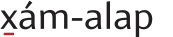

<span style="color:#bf2229">U+0331 COMBINING MACRON BELOW</span> is combining mark that sits below the preceding base letter. It corresponds to the above-base macron, U+0304, and is typically a short line similar in width to other marks such as the circumflex and breve. Its width does not normally change relative to that of the base letter.


<span style="color:#bf2229">U+0332 COMBINING LOW LINE</span> is also a combining mark that consists of a line below the preceding base letter. It is typically wider than the macron mark, and its width may vary relative to that of the base to which is is applied:


In Skeena Indigenous, three different widths of the combining low line are provided, and are contextually substituted as determined by the width of the base letter.

The key difference between these two combining marks is not graphical, but behavioral. The U+0332 combining low line character is intended to connect when applied to two or more base letters in sequence:


The U+0331 combining macron below, in contrast, would remain a clearly separate mark below each letter:


On typewriters, a line below a base letter was achieved by backspacing and typing the underscore key, which graphically resulted in a longer line than associated with the typographic macron. This has meant that communities whose alphabets derive from the conventions of Americanist linguists have tended to favor longer low line marks, and selected U+0332 in preference to U+0331. It may be important to consider whether the difference in joining behavior between the two mark characters—presuming this behavior is implemented in the font, as it is in Skeena Indigenous (see `rclt` discussion below)—reflects the orthographic intention of a community. For example, is the joined line below three letters in the sequence **s̲d̲z̲** in the first illustration above intentional, or would the word—which means “moth” in the Dakelh language of the Yekooche First Nation—be better represented with the diacritics distinguished like this:


The confusability of U+0331 and U+0332 is further complicated by the existence of several precomposed Unicode diacritic characters that are named as “with line below”, *e.g.*

* U+1E0F LATIN SMALL LETTER D WITH LINE BELOW

Perhaps confusingly, considering this naming, these diacritic characters have canonical decompositions to the base letter plus U+0331, *the combining macron below.* Since these diacritics exist as atomic characters in Unicode, some communities may have adopted them for convenience without considering their decomposition. This may result in sequences of diacritics in which one is normalized as letter plus U+0331 while another is input from the keyboard as letter plus U+0332. In Skeena Indigenous, the two marks are coordinated in thickness and vertical alignment to make the best, graphically, of such a situation.

##### Greek vs Latin

Some of the Latin orthographies of indigenous language include letters derived from the Greek script. Gradually, most of these have been given distinct Latin encodings in Unicode, usually because their casing forms differ in some way from those in Greek. In unicase orthographies based on the North American Phonetic Alphabet, Greek character encodings may still be used for some of these letters, and in text Greek and Latin codepoints may occur as a result of older or newer keyboards or copying and pasting of characters.

In fonts that support both Latin and Greek scripts, the form of Greek characters employed within Latin orthographies may need to be differentiated from the default Greek forms at the glyph level. This is the case if the Greek design follows traditional stroke modulation patterns of that script that contrast with the Latin patterns, as in this example from the [Brill](https://www.tiro.com/fonts/brill) typeface:

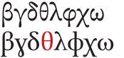

*Greek letters in traditional style (top) contrasted with latinized variants for use in IPA, NAPA, and derived writing systems (bottom). All of the latter also have distinct Latin encodings except the* <span style="color:#bf2229">theta</span>. *Not all these Greek-derived letters occur in indigenous orthographies, so only some are included in Skeena Indigenous.*

Since Skeena Indigenous does not support the Greek script except for those few characters used in some indigenous orthographies—**θ λ ꭓ**—, the same Latin-appropriate forms are used for both Greek and Latin characters. This means, of course, that there are no visual clues as to whether typeforms occurring in text are encoded as Greek or Latin characters.

A few uppercase letters are cross-script confusable, such as the Greek Lambda **Λ** (U+030B) and Latin turned-V **Ʌ** (U+0245), and the Greek Theta **Θ** (U+0398) and Latin barred-O **Ɵ** (U+019F). In Skeena Indigenous, these too are identical.

##### Letters vs symbols

Some diacritic letters in Unicode bear resemblance to currency or other symbols, and may be encountered as such in indigenous language texts, either by accident or because they have been selected as standard encodings by a community on the basis of convenience or because they most closely correspond to the locally expected the form of the letter. As in other cases of confusable characters, font makers need to decide whether to accommodate those encodings by tailoring the form of the symbol characters to match community expectations, or to differentiate the symbols from the similar letters and encourage use of the latter. There is no easy or obviously correct decision given that some of these symbol characters are enshrined as letters in specific orthographies.

The cent currency symbol **¢** (U+00A2) is frequently designed with a vertical bar, but occurs in some orthographies in place of the diagonally slashed-c **ȼ** (U+023C). In Skeena Indigenous, the cent is given a diagonal stroke to match the diacritic letter.

Unicode includes a barred-K diacritic **Ꝁ** (U+A740). In most typefaces the bar is a short stroke through the upper part of the vertical, so this character was not selected for inclusion in the alphabet of the SENĆOŦEN (Saanich) language of southern Vancouver Island; rather, the currency symbol for the Lao kip ₭ (U+20AD) was chosen because its shape—with a long bar through the middle of the letter—corresponded with community expectations. Since the barred K diacritic in SENĆOŦEN is unique among North American indigenous orthographies, Skeena Indigenous contains only the kip character, and not U+A740 or its lowercase equivalent U+A741.

#### Casing

Casing is the mapping between related pairs of characters, as typified by the relationship of upper- and lowercase letters in many alphabets. Casing is a property of writing systems, *i.e.* of the application of a set of characters in a script to a particular language; for example, the casing behavior of upper- and lowercase letters in the English alphabet and the orthographic and typographic conventions governing how these are used. In Unicode, however, casing is standardized as a property of *characters.* With few exceptions, all Unicode lowercase Latin characters have a corresponding uppercase character, and the mapping between them is a property of each. This enables casing of Latin script text in software, including various kinds of case conversion such as all-caps and title case settings, which might be applied directly by a user or result from document styles.

Some North American indigenous writing systems include casing behavior, employing upper- and lowercase letters in ways similar to European orthographies, but a significant number use only lowercase letters. This reflects their derivation from the uncase North American Phonetic Alphabet developed by linguists studying indigenous languages. The decision to use or not use uppercase letters is the right of any community deciding how its language should be written, as it is their right to revise that decision at any time.

Skeena Indigenous includes uppercase characters for every corresponding lowercase character, even if the latter is only attested in orthographies that do not employ casing. This ensures that if case conversion is applied to text, even erroneously, no letters will display as missing characters, and also leaves the door open to any community that decides it wants to introduce casing as a feature of its written language.

In some situations, software should apply tailored casing rules for a language, to prevent unwanted case conversion that might break orthographic norms or introduce textual ambiguity. The SENĆOŦEN alphabet is notable for being *mostly* all-caps and not using lowercase letters except for **s**, which is semantically distinct from **S**. This means that case conversion should be avoided, both to reflect the cultural norms of the writing system and preserve the semantic distinction between the upper- and lowercase **S** and **s** characters.

### Glyphset

The [Skeena Indigenous glyphset](https://github.com/microsoft/Skeena-Indigenous-Typeface/blob/main/source/SkeenaIndigenousGlyphset.csv) is documented in a CSV (comma-separated values) format table, which for convenience can be imported into any common spreadsheet software. The columns from left-to-right are:

* **Sort** Corresponding to the glyph ID (GID) in the fonts.
* **Unicode** The Unicode hexadecimal codepoint for each encoded glyph; blank if glyph is unencoded.
* **Char.** The Unicode character of each encoded glyph; blank if the glyph is unencoded.
* **DevName** The human-friendly glyph name used in design and build input sources.
* **PostName** The final font glyph name as written in the TTF post table; this name is substituted for the DevName during the build process using the `SI-Dev2Post.ren` file mappings. [Note that some parts of the build configuration, notably the rvrn input rules in the .designspace files use PostNames.]
* **Set** Classification of the glyph in terms of language set use (see categories listed below).
* **UnicodeName** The Unicode name of each encoded glyph; blank if the glyph is unencoded.
* **OTL** The OpenType Layout feature(s) with which unencoded glyphs are associated; some glyphs may be accessible via more than one OTL mechanism.
* **Comment** Notes about the use or design of the glyph or, in some cases, a documentation source (this is most common for characters and glyphs used in languages outside the Pacific Northwest, as documented in Typotheque’s *Indigenous North American Type*).

The classifications used in the Set column reflect the process of initial planning and then expansion of the glyph to additional languages. The sets are:

* **Common** Glyphs that may be used across all writing systems, such as punctuation, numerals, math operators, and other symbols.
* **Euro** Glyphs inherited from the original Skeena fonts that would not occur in indigenous language texts except in foreign names or words.
* **PNWIL** Glyphs used in one or more Pacific Northwest indigenous language orthographies and not found in European alphabets.
* **PNWIL+Euro** Glyphs shared by Pacific Northwest indigenous and European orthographies.
* **NA+** Glyphs found in North American orthographies outside of the Pacific Northwest.

Individual glyph classifications may change in future as additional orthographies are documented.

### Glyph decisions

A typeface is a coordinated set of glyphs, whose structures, proportions and details inform the design of each other. This is why typeface design is reflective and iterative: decisions in one place affect decisions in other places, and changes to the scope or focus of a typeface may require revision of existing glyphs. Making a typeface indigenous-first requires taking into account specific aspects of indigenous orthographies that differ from those of European languages. Similarly, making a typeface indigenous-first implies different decisions about the default form of some characters.

#### Punctuation

In the original Skeena design proposals and MS Office release, the comma and related shapes were simple, slightly curved strokes. If this form were applied to the related combining mark sign U+0313 comma above (and U+0315 comma above right), the result would be too easily mistaken for the acute accent:


In Skeena Indigenous, a clearly distinct and identifiable form of the apostrophe-like combining marks implied a redesign of all the related punctuation:

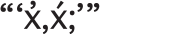

[This redesign was so successful that these forms are being rolled into updates to the Skeena fonts for European languages also: a case of indigenous-first design influencing the typography of settler languages.]

#### Ogonek

The ogonek is a small hook shape below a base letter, most commonly connecting to the letter. It is used in numerous writing systems in Europe, the Americas, and Africa to indicate nasalization of a vowel, so is sometimes referred to as the nasal hook. The form of the ogonek derives from a mediaeval scribal sign, the *e caudata*, and in European typography it follows the conventional writing of that sign in how it attaches to various vowel letters:


In North American indigenous use, positioning of the ogonek is informed by typewriter output, in which the backspaced sign was centered below the preceding letter. This positioning is retained in the typography of these languages, which means on bases like the uppercase **A** the ogonek does not connect to the letterform. The ogonek is also applied to additional vowels in some indigenous orthographies, in base+mark sequences that do not occur in European languages.


In Skeena Indigenous, this positioning with centered ogonek below is the default for both precomposed diacritic characters and dynamically positioned mark. [Since the fonts also support European languages, the ogonek diacritic letters for the latter are handled as localized variants; see discussion of the `locl` feature in the glyph processing section below.]

Some communities have evolved their own forms of the ogonek sign, and these are supported in Skeena Indigenous as localized and stylistic variants. For consistency, the variants are provided for all precomposed ogonek diacritic letters, as well as combining mark glyphs, even if specific combinations are not attested in the orthographies of the languages in which these variants occur. See discussion of the `locl` and stylistic set features in the glyph processing section, below, for details of the implementation of these variants.


*Reversed-cedilla ogonek variant*

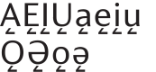
*Angled ogonek variant*

#### Eng

Different forms of the uppercase letter **Ŋ** are in use around the world, all unified in a single character encoding, U+014A. The form of this character used in North American indigenous alphabets follows the shape of the uppercase **N** with a descending hook:

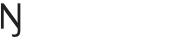

Since only this form is attested in North American orthographies documented to date, it is the only one provided in Skeena Indigenous.

This form is also used in European alphabets for Sámi languages of northern Scandinavia, so is suitable for fonts supporting both European and North American languages. If fonts also aim to support sub-Saharan African languages, additional forms of this letter will be required.

#### Numerals as letters

There is a longstanding practice of using two numeral characters as letters in some indigenous alphabets. This appears to derive from convenience, the numerals roughly approximating the shape of characters that were missing from typewriters or individual fonts.

The numeral **7** is encountered as a stand-in for the glottal letter **ʔ** and, more rarely, the numeral **3** appears for the letter ezh **ʒ**. This use of numerals as letters can cause spacing problems within words when, as in Skeena Indigenous, the default numeral set is on fixed, tabular widths. A mechanism needs to be provided to coordinate the spacing of these numerals with that of other letters when used as such, and the **7** in particular requires careful kerning (see glyph processing discussion below about the `rclt` feature).

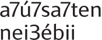

*Example words from the Líl̓wat and ɔ’ɔ́ɔ́ɔ́naakíit’ɔ (Aaniiih) languages showing use of the numerals 7 and 3 as letters.*

#### Variants

A number of characters in Skeena Indigenous have one or more alternative forms that are local preferences associated with individual languages or may be recognized as free, stylistic variants. Identifying, documenting, and supporting local variations in the shape of letters and other characters 

In addition to the variant ogonek forms shown above, Skeena Indigenous currently includes the following (default form shown first):

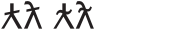
U+A7DC LATIN CAPITAL LETTER LAMBDA WITH STROKE  
U+019B LATIN SMALL LETTER LAMBDA WITH STROKE  
The variant form with a wavy bar is attested in the orthographies of Heiltsuk, Kwakʼwala, and Nuu-chah-nulth on Vancouver Island.


This variant form applies also to the combination of this letter with the apostrophe-like mark (U+0313), which may be implemented as a precomposed glyph in some fonts to better manage the conventional nested position of the mark (this is the case in Skeena Indigenous).

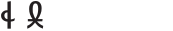
U+026C LATIN SMALL LETTER L WITH BELT  
This distinctive looped form with crossbar is found in the alphabet of the Lushootseed language in coastal Washington State.

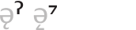
U+02C0 MODIFIER LETTER GLOTTAL STOP  
This angled form of the raised glottalization sign is attested in the orthographies of the Iroquoian languages Cayuga, Onondaga, and Seneca. It is a variant that corresponds to the angled ogonek mark, shown here in gray.

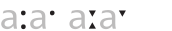
U+02D0 MODIFIER LETTER TRIANGULAR COLON  
U+02D1 MODIFIER LETTER HALF TRIANGULAR COLON  
These characters are, respectively, long and half-long vowel indicators. As their Unicode names indicate, the triangular forms are the norm (derived from IPA usage), but the convention across indigenous orthographies is to use a round dot, so that is the default form in Skeena Indigenous and the triangular variant is available as a stylistic alternative. [See comments above regarding confusable encodings for the colon.]

### Glyph processing

The Skeena Indigenous fonts contain OpenType Layout substitution and positioning tables. Many of the OTL features are common to many fonts, such as access to variant numeral forms for tabular vs proportional spacing, superscripts and subscripts, and fractions, and case-sensitive forms for all-caps settings. These are not described in detail here. The following details pertain to implementation that is particular to Skeena Indigenous and to support for indigenous language typography.

In this section, VOLT lookup syntax is used to document substitutions. Font makers working with other tools should translate these into appropriate syntax, *e.g.* AFDKO .fea code.

#### [`rvrn`](https://learn.microsoft.com/en-us/typography/opentype/spec/features_pt#rvrn) Required Variation Alternates

This feature performs preliminary glyph substitutions triggered by locations within a variable font design space. In Skeena Indigenous, this is used to swap in simplified constructions of the **\$** and **ⱥ** characters at weights above Bold.

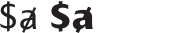

Note that the input for the `rvrn` feature substitutions is programmed directly in the .designspace file, not in the VOLT project used for all other OpenType Layout. During the build process, this substitution is also applied during instantiation of static fonts, so these simplified forms appear as default glyphs in the Extra Bold and Black fonts.

#### [`locl`](https://learn.microsoft.com/en-us/typography/opentype/spec/features_ko#locl) Localized Forms

In the OpenType Layout GSUB table, a number of variant glyph substitutions are applied for individual languages via LangSys tags. Some of these LangSys tags for indigenous languages or language groups are recent additions to the registry, prompted by the Skeena Indigenous research and development. These `locl` feature substitutions precede other aspects of layout and affect the input set of glyphs for subsequent GSUB and GPOS lookups.

##### European ogonek

Substitution of glyphs with conventional European attachment of ogoneks is applied via the `locl` feature for the following LangSys tags:

* `CSB` Kashubian
* `LTH` Lithuanian
* `PLK` Polish

##### Reversed-cedilla ogonek

Substitution of the horizontally flipped cedilla form of the ogonek is applied for the following LangSys tag:

* `CHP` Chipewyan

##### Angled ogonek and glottal modifier

The acute-angled subscript mark form of ogonek and corresponding glottal modifier sign is applied for the following Iroquoian LangSys tags:

* `CAY` Cayuga
* `ONO` Onondaga
* `SEE` Seneca

##### Wavy-barred Ƛ and ƛ

The alternative form of the barred Latin lambda with a wavy bar encountered in some Vancouver Island alphabets is applied for the following LangSys tags:

* `HEI` Heiltsuk
* `KWK` Kwakʼwala
* `NUK` Nuu-chah-nulth

##### Lushootseed cursive ɬ

The looped and barred form of the belted-l character is applied to the following LangSys tag:

* `LUT` Lushootseed

In addition to these localized form substitutions applying or overriding indigenous language norms, Skeena Indigenous applies some common localized diacritic handling for the European languages Catalan and Dutch.

#### [`ccmp`](https://learn.microsoft.com/en-us/typography/opentype/spec/features_ae#ccmp) Glyph Composition / Decomposition

Use of `ccmp` substitutions in Skeena Indigenous is quite limited. This is one of the principal differences that may be found between different font implementations for indigenous languages: because some diacritic letters in target orthographies are encoded as sequences of base letter followed by one or more combining marks, some font makers may opt to compose these sequences into atomic glyphs in `ccmp`. This may be an attractive option if working with a small, language-specific character set, if the design involves unusual, base-specific mark handling such as merging with some letter shapes, or if there are known kerning exceptions for diacritics that will be easiest managed using precomposed glyphs.

In Skeena Indigenous, most base+mark sequences are displayed using GPOS anchor attachment. This is a flexible mechanism, suitable for a font targeting a large set of orthographies, not all of which are stable or exhaustively documented. Dynamic mark positioning avoids the need to identify every attested combination of base+mark(s) that occur across all the languages.

A font may use a mix of methods, of course, and in Skeena Indigenous some base+mark sequences are precomposed because the marks merge with the base in some way. Since these `ccmp` substitutions are applied after the `locl` substitutions, the output glyphs from the latter are included here: 

```
Schwa ogonekcomb -> Schwaogonek
Schwa ogonekcomb.alt -> Schwaogonek.alt
Schwa ogonekcomb.alt2 -> Schwaogonek.alt2
schwa ogonekcomb -> schwaogonek
schwa ogonekcomb.alt -> schwaogonek.alt
schwa ogonekcomb.alt2 -> schwaogonek.alt2
L wavyvarcomb -> Lwavybar
l wavyvarcomb -> lwavybar
```
Other base+mark sequences are precomposed in `ccmp` because a particular mark may take an irregular position on a particular base:

```
Lambdabar commaabovecomb -> Lambdabarcommaabove
Lambdabar.alt commaabovecomb -> Lambdabarcommaabove.alt
lambdabar commaabovecomb -> lambdabarcommaabove
lambdabar.alt commaabovecomb -> lambdabarcommaabove.alt

```
In Skeena Indigenous, the combining low line mark U+0332 is precomposed with bases *if there is a corresponding precomposed character with U+0331 macron below.* This is to enable potential one-to-one substitutions if a longer low line is desired for those diacritic characters by some communities (this is not yet implemented for any languages).

```
D lowlinecomb -> Dlinebelow
d lowlinecomb -> dlinebelow
h lowlinecomb -> hlinebelow
L lowlinecomb -> Llinebelow
l lowlinecomb -> llinebelow
T lowlinecomb -> Tlinebelow
t lowlinecomb -> tlinebelow
Z lowlinecomb -> Zlinebelow
z lowlinecomb -> zlinebelow
```
The `ccmp` feature is also used to implement some contextual handling of base and mark variations:

* when **i** and **j** bases, including diacritic forms such as **į** and **ɉ**, are followed by above combining marks, dotless forms of base are contextually substituted;
* when narrow lowercase x-height bases such as dotless *i* and *j* forms carry a combining breve or inverted breve, a narrower form of that mark is used to improve spacing with adjacent ascenders or other marks;
* when a mark occurs above an uppercase letter or ascender, a vertically foreshortened .cap variant mark is substituted.

#### [`rclt`](https://learn.microsoft.com/en-us/typography/opentype/spec/features_pt#rclt) Required Contextual Alternates

This feature applies contextual substitutions to ensure correct display and spacing of some sequences.

When the numerals 3 and 7 and the colon punctuation sign occur between letters—indicating that they are being used, respectively, as letters or vowel length indicator—appropriately spaced glyphs are substituted:

```
three -> three.LP
seven -> seven.LP
colon -> colonmodifier

<letters_all> |
| <letters_all>
```

In Skeena Indigenous, the .LP lining proportional numerals are substituted; in another typeface, specific numeral-as-letter variants might be designed.

The `rclt` feature also handles width selection of the low line combining mark U+0332 and joined connection of that mark on adjacent bases.

The connection of the low line marks is handled by contextually inserting a zero-width connecting line glyph between the bases. The outline of this connector line needs to be narrow enough to accommodate a narrow base on either side and wide enough to connect the low line under two wide bases. The connector needs to be inserted after the lowline mark and also after the `ccmp` precomposed sequences:

```
lowlinecomb -> lowlinecomb lowlinecomb.connect
Dlinebelow -> Dlinebelow lowlinecomb.connect
dlinebelow -> dlinebelow lowlinecomb.connect
etc.

| <letters_linebelow>
| <letters_all> lowlinecomb
```
Then three subsequent lookups contextually substitute the appropriate width of the low line mark as determined by the width class of the base letter it follows. Skeena Indigenous includes wide, medium and narrow variants of U+0332; other fonts could include more or fewer as appropriate to their design and the degree of precision desired.

#### [`ssXX`](https://learn.microsoft.com/en-us/typography/opentype/spec/features_pt#ssxx) Stylistic Sets

Stylistic set features provide access to font-specific variant glyphs at user discretion (presuming software support). Each set provides access to one or more glyphs that constitute a coordinated stylistic variation. The sets can be applied individually or in combination (again, presuming software support).

In Skeena Indigenous, the first stylistic set feature `ss01` is used to apply a variant form of the lowercase g letter and associated diacritics, only in the roman (upright) font style:

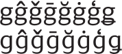

Use of this feature should be avoided if an orthography makes a semantic distinction between these two forms of lowercase g

* U+0067 LATIN SMALL LETTER G
* U+0261 LATIN SMALL LETTER SCRIPT G

and further work may be required to provide appropriate defaults for such orthographies in both roman and italic font styles.

The remaining stylistic set features in Skeena Indigenous provide overrides or toggles to default glyph forms, providing users with access to variant glyphs regardless of `locl` feature output. So, for example, for default language processing the `ss02` toggle feature turns on the reversed-cedilla ogonek variants, while for those LangSys tags for which that form is the localized form, it switches to the default ogonek shape.

* `ss02` toggles reversed-cedilla ogonek form
* `ss03` toggles angular ogonek form
* `ss04` toggles European ogonek placement
* `ss05` toggles barred-Lambda/lambda form
* `ss06` toggles belted-l form
* `ss07` toggles glottal modifier form
* `ss08` substitutes triangular vowel length marker

This stylistic set features can be used to override localized forms, or to activate them in software where automated LangSys mapping is not available or where the language of a text is not tagged.

The Skeena Indigenous build configuration YAML file includes [Feature Parameter](https://learn.microsoft.com/en-us/typography/opentype/otspec184/chapter2#feature-table) name entries for these stylistic set features:

```
featureparams:
  ss01: Hooked g form (roman only)
  ss02: Reversed-cedilla ogonek toggle
  ss03: Angular ogonek toggle
  ss04: European ogonek placement
  ss05: Barred-Lambda/lambda toggle
  ss06: Belted-l toggle
  ss07: Glottal modifier toggle
  ss08: Triangular long vowel marker
```
These names may be displayed in the user interface of software that provides access to the features.

#### [`cvXX`](https://learn.microsoft.com/en-us/typography/opentype/spec/features_ae#cv01-cv99) Character Variants

The character variant features provide an alternative mechanism to access variant forms of glyphs. Unlike the stylistic set features, which may apply across a range of characters in a coordinated style, character variant features focus on individual character inputs (although, as in the case of the Skeena Indigenous ogonek variants, this may imply multiple related characters).

* `cv01` applies wavy-bar variants of **Ƛ** and **ƛ**
* `cv02` applies the Lushootseed cursive variant of **ɬ**
* `cv03` applies enumerated variant forms of **Ą Ę ą ę** etc.
* `cv04` applies the angular form of **ˀ**

Note that the `cv03` feature employs a one-to-one-of-many substitution lookup, in which each of the different variant forms of the ogonek are enumerated:

Glyph variation 1 = reversed-cedilla ogonek  
Glyph variation 2 = angular ogonek  
Glyph variation 3 = European ogonek

Because these features are applied after `ccmp`, they also affect base+mark sequences that are precomposed in that step.

Like the stylistic sets, the character variant features have Feature Parameter name entries in the YAML build configuration file:

```
featureparams:
...
  cv01:
    label: Barred-Lambda/lambda
    tooltip: Wavy barred-lambda form
    characters: [0x07DC, 0x019B]
  cv02:
    label: Belted-l
    tooltip: Lushootseed cursive belted-l
    characters: [0x026C]
  cv03:
    label: Ogonek
    tooltip: 1. Reversed-cedilla ogonek. 2. Angular ogonek. 3. European ogonek.
    characters: [0x0104, 0x0118, 0x012E, 0x01EA, 0x01EC, 0x0172, 0x0105, 0x0119, 0x012F, 0x01EB, 0x01ED, 0x0173, 0x0328]
  cv04:
    label: Glottal modifier
    tooltip: Angled glottal stop modifier
    characters: [0x02C0]
```

### Kerning

Good spacing is important to all typography. General spacing of glyphs in horizontal sequence is provided by their sidebearings and advance widths. Exceptions to that general spacing are implemented via the GPOS [`kern`](https://learn.microsoft.com/en-us/typography/opentype/spec/features_ko#kern) feature. Kerning is stored as a set of pair-specific negative or positive deltas to advance widths, and is compressed through grouping of glyphs in kerning classes based on similar left or right outline shape and/or vertical alignment.

The orthographies of North American indigenous languages involve letterforms and other signs that are not found in European typography, and some of these require significant amounts of kerning data to be correctly spaced relative to preceding and following glyphs. This is especially true of superscript modifier letters, and letterforms with irregular shapes and much inherent whitespace such as **ʔ** and **7** used as a letter. 

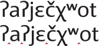

*ʔaʔjɛčχʷot, a word meaning “How are you?” in the ʔayʔaǰuθəm language of the Homalco First Nation (Bute Inlet, BC). In the top line, kerning is active, while in the lower line only general spacing is applied, leaving small irregularities in the overall spacing. Cumulatively, these irregularities disrupt the visual coherence of words.*

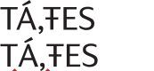

*TÁ,ŦES, a word meaning “eight” in the SENĆOŦEN language of the W̱SÁNEĆ People (southern Vancouver Island). The comparison of kerned (top) and unkerned (bottom) glyphs illustrates how kerning adjustments are particularly important in the typography of this all-caps orthography in which the comma sign may occur mid-word.*

To ensure correct display of text in indigenous languages, kerning should not be considered optional and care should be taken to confirm that it is active in software. Notably, in Microsoft Word, it is necessary to turn on kerning for selected text in the Font formatting dialogue:


When developing kerning for specific target languages, or for well-documented sets of languages, font makers may be able to determine which pairs of glyphs do and do not occur in text. For major national and regional languages, readily-available dictionaries, word lists, and text corpora can be trawled for real-world test cases for spacing and kerning. When making fonts for minority and endangered languages, such resources are often not available, and a font family like Skeena Indigenous that targets a large number of unequally documented languages requires a different approach to kerning.

The kerning in Skeena Indigenous is based on glyph shape, rather than linguistic and textual data. This means that glyphs or classes of glyphs are previewed systematically, and adjustments are applied to any pairs that appear too tight or too loose. This inevitably means that some glyph sequences are kerned that will never occur in text, either because they involve pairs of characters that do not occur together in any orthography, or because they represent phonemically impossible combinations within a language.

Font makers working with individual indigenous language communities may be able to filter potential kerning pairs on the basis of phonemic analysis or by building word lists with language keepers.

### Conclusion

The Skeena Indigenous project has four aims:

1. To provide indigenous language communities with a free family of fonts in a clear, legible style and useful range of weights for a variety of typographic uses.
2. To provide in these fonts a focal point for discussion and engagement with those communities and organizations supporting indigenous language revitalization.
3. To provide sources and documentation as a model for an approach to making fonts for large numbers of North American indigenous languages.
4. To be a source for forked (derivative) projects e.g. more specifically targeting the typography of individual languages or perhaps supporting languages outside of North America.

With regard to the last of these, some additional information about the sources and build tools may be useful to people interested in forking the project to make derivative fonts:

Skeena is a Microsoft trademark as is Reserved Font Name under the terms of the Open Font License. This means that any forks of the project need to use different names in derivative fonts.

The .ufo format build files can also be used as design sources and can be opened in all modern font tools. If you want to edit the shape of any existing glyphs or add glyphs, you will probably want to do so directly in the .ufo files or in tool-specific sources derived from them.

Microsoft VOLT was used in the development of Skeena Indigenous, but the OpenType Layout projects can be converted to AFDKO .fea code using the FontTools [`voltToFea`](https://fonttools.readthedocs.io/en/latest/voltLib/voltToFea.html) converter.

If you do not need to edit or add glyphs or make changes to the OTL project and only want to fork a subset of Skeena Indigenous, e.g. for a particular language, you can do so by creating a new YAML build configuration file using supported subsetting syntax. You can also use this method to re-map characters, meaning you can swap the Skeena Indigenous default glyphs in the `cmap` table with language-specific variant glyphs. For example, you could create a Heiltsuk-specific font by defining a subset glyph list and a remapping of the barred-lambda character codepoints to the wavy-bar variant glyphs.

For a detailed explanation and examples of all the build configuration options available, please refer to the [TiroTools](https://github.com/TiroTypeworks/TiroTools/tree/master/Builder) repo.
